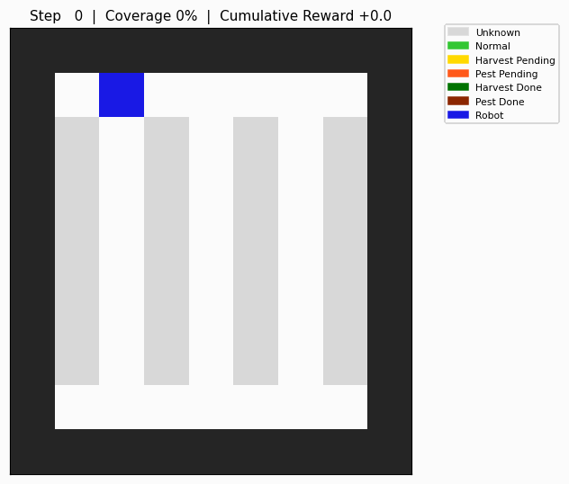
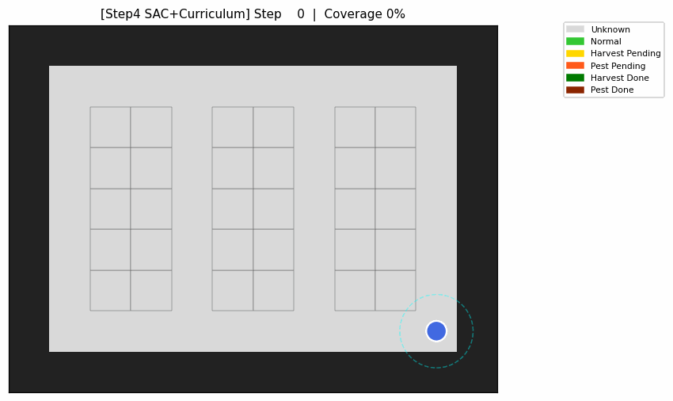

# 정밀농업 자율 로봇 강화학습

부분 관측 농경지에서 자율 로봇이 작물 상태를 확인하고 필요한 작업을 수행하도록 학습하는 커스텀 강화학습 프로젝트입니다.

이 프로젝트는 단일 정책부터 계층형 정책, 연속 제어까지 환경을 단계적으로 확장하며 **보상 함수보다 관측 공간 설계가 정책 성능에 미치는 영향**을 비교합니다.

## 핵심 결과

| 단계 | 환경 및 정책 | 성공률 | 평균 스텝 |
|---|---|---:|---:|
| Step 1 | MaskablePPO 기반 Flat RL | 96% | 147 ± 80 |
| Step 2 | Hierarchical PPO | 98% | 198 ± 349 |
| Step 3 | 거리 관측 + DQN High-level | **100%** | **141 ± 3** |
| Step 4 | SAC + 단순화 관측 기반 연속 제어 | 96.7% | 157 ± 194 |

Step 3에서는 거리 정보를 상위 정책에 추가하여 가장 가까운 미완료 레인을 선택하는 안정적인 정책을 학습했습니다. 연속 제어 환경에서는 `nav_flags`와 관측 단순화가 성능 개선에 크게 기여했습니다.

자세한 환경 설계, 실험 결과와 시행착오는 [report.md](report.md)에서 확인할 수 있습니다.

## 데모

| Step 1: Flat RL | Step 3: 계층형 정책 | Step 4: 연속 제어 |
|---|---|---|
|  |  |  |

## 저장소 구조

```text
.
├── env/
│   ├── farm_env.py                       # 이산 Flat RL 환경
│   ├── hierarchical/                     # 계층형 RL 환경
│   ├── continuous_farm_env.py            # 연속 제어 환경
│   └── continuous_farm_env_curriculum.py # 관측 단순화 및 스폰 레벨 지원
├── tests/                                 # 환경 동작 테스트
├── train.py                               # Step 1
├── train_hierarchical.py                  # Step 2
├── train_step3.py                         # Step 3
├── train_sac_curriculum.py                # Step 4
├── evaluate_step3.py                      # Step 1~3 비교 평가
├── evaluate_greedy_lane.py                # Step 3 RL/Greedy 비교
├── train_td3.py / train_tqc.py            # Step 4 알고리즘 비교
├── train_recurrent_ppo.py                  # Action Masking 보조 실험
├── train_hierarchical_*_cont.py            # 연속 계층형 실패 실험
└── report.md                              # 전체 연구 보고서
```

## 설치

Python 3.10 환경을 권장합니다.

```bash
pip install -r requirements.txt
```

## 실행

학습된 모델은 `models/`에 저장되며 Git에는 포함하지 않습니다.

```bash
# 학습
python train.py
python train_hierarchical.py
python train_step3.py
python train_sac_curriculum.py

# Step 1~3 비교 평가
python evaluate_step3.py
python evaluate_greedy_lane.py

# 대표 데모 생성
python record_gif_step3.py
python record_gif_sac_curriculum.py
```

## 테스트

```bash
pytest tests/ -q
```

## 주요 발견

- 동적 제약이 강한 이산 행동 공간에서는 Action Masking이 학습 가능성을 좌우했습니다.
- 계층 구조만 추가하는 것으로는 성능이 안정되지 않았으며, 거리 관측을 추가했을 때 정책이 크게 개선되었습니다.
- 연속 제어에서는 전체 작물 정보를 제공하는 것보다 가까운 작물과 이동 가능 방향만 제공하는 편이 효과적이었습니다.
- 학습 모델과 대용량 중간 산출물은 저장소에서 제외하고 필요 시 별도로 배포하는 것이 적절합니다.

## 재현 범위

최종 정책뿐 아니라 보고서에서 비교하거나 실패 사례로 분석한 실험 코드도 보존합니다. 학습 모델 바이너리는 저장소 크기를 줄이기 위해 포함하지 않으므로, 평가 스크립트를 실행하려면 먼저 대응하는 학습 스크립트를 실행해야 합니다.
