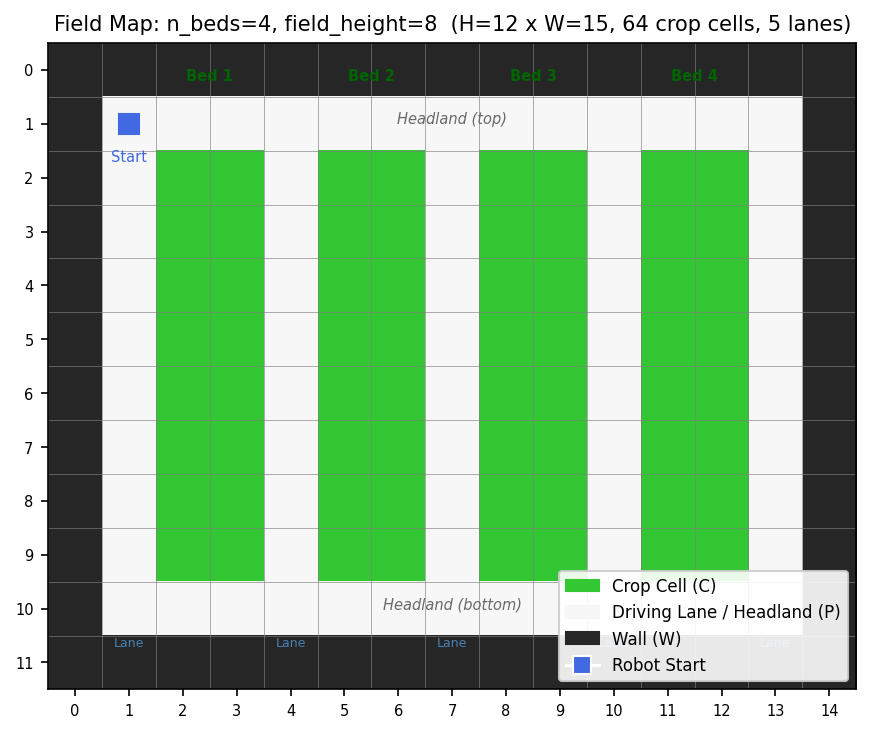
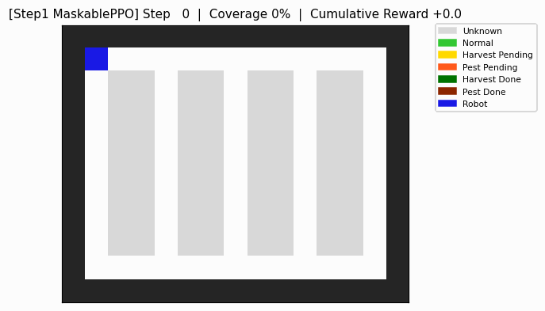
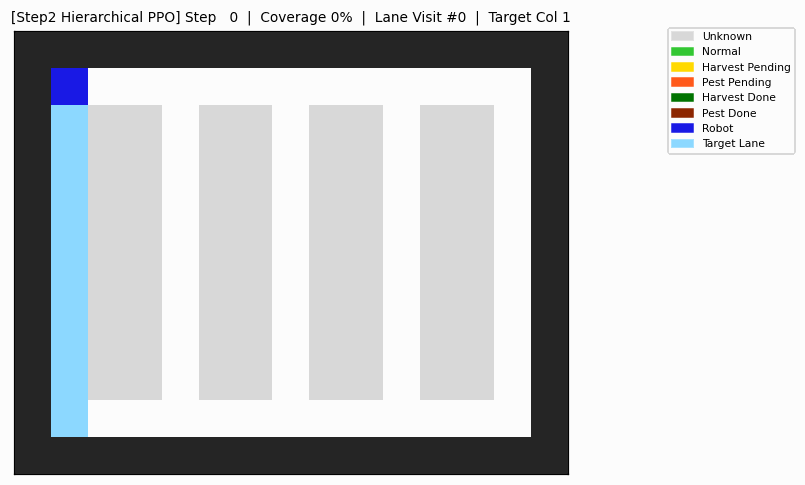
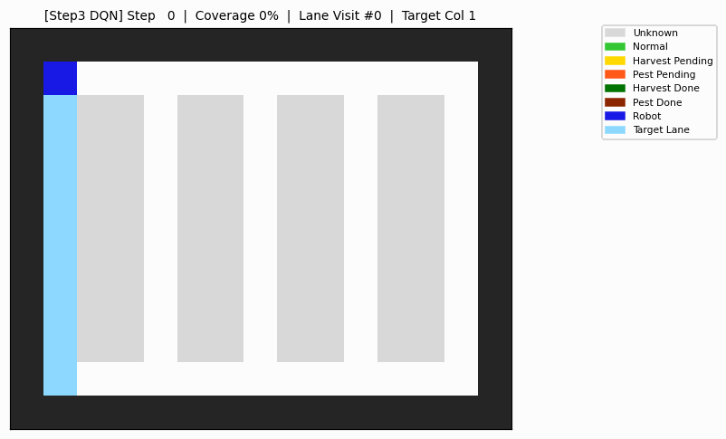
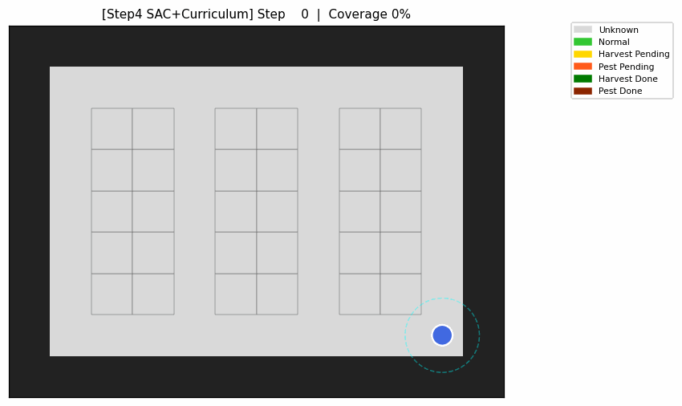

# 고급 강화학습 프로젝트

## 온실 내 로봇 주행을 강화학습으로 풀어보기

**학번·이름**: 25113021 신동석

**코드 GitHub 주소**: https://github.com/elasmobranches/2026-1_RL_PROJECT

**최종 제출본**: [RLproject_report_final.pdf](RLproject_report_final.pdf)

---

## 1. 해결하고자 하는 문제 정의

### 1.1 연구 배경 및 동기

농업 환경에서 자율 로봇은 방제, 수확, 예찰 등 다양한 작업을 수행할 것으로 기대된다. 그러나 로봇이 각 작업을 수행하는 과정에는 어느 구역을 먼저 돌 것인지, 어떤 순서로 레인을 방문할 것인지, 작물 상태를 확인하고 어떤 조치를 취할 것인지 등 다양한 의사결정 요소가 존재하며, 모든 결정이 전체 작업 효율을 좌우한다.

기존에는 이런 경로·순서 결정을 사람이 설계한 휴리스틱으로 처리해왔다. 휴리스틱은 잘 설계되면 효과적이지만 문제마다 적절한 규칙을 사람이 직접 고안해야 하고, 작물 상태를 미리 알 수 없는 부분 관측 환경에서는 탐색과 조치의 순서를 명시적 규칙으로 설계하기 어렵다.

본 프로젝트는 명시적 수행 규칙을 프로그래밍하지 않고, 보상과 관측 설계만으로 로봇이 효율적인 작업 정책을 스스로 학습하도록 하는 것을 목표로 한다. 즉, 정밀농업 로봇의 작업 수행 정책을 강화학습 문제로 정의하고 이를 위한 커스텀 환경을 설계·적용한다.

### 1.2 문제 정의

농업용 자율 로봇은 다음 세 가지 핵심 조건을 동시에 만족해야 한다.

| 조건 | 설명 | 의사결정 요소 |
|---|---|---|
| 충돌 없는 이동 | 작물 구역·벽과 충돌하지 않고 레인만 주행 | 어느 레인을 경유할지 |
| 전체 예찰 | 모든 작물 셀을 빠짐없이 예찰 | 방문 순서·경로 패턴 |
| 상태 기반 조치 | 예찰 결과에 따라 정상·수확·방제를 구분하고 적절한 행동 수행 | 조치 타이밍·우선순위 |

본 문제는 다음 이유로 강화학습과 부합한다.

1. 매 스텝의 이동 선택이 이후 도달 가능한 영역과 잔여 작업량에 영향을 미치는 순차적 의사결정 문제다.
2. 작물 상태는 예찰 전까지 완전히 관측되지 않는 부분 관측 환경이다.
3. 최적 예찰 경로는 작물 상태와 이상 개체 분포에 따라 매 에피소드마다 달라지는 조합 최적화 문제다.

### 1.3 연구 질문 및 검증 설계

본 연구는 알고리즘의 복잡도를 단계적으로 확장하며 다음 네 가지 연구 질문을 검증한다.

| 단계 | 연구 질문 |
|---|---|
| Step 1 | 단일 정책이 이산 격자 환경에서 동적 행동 마스킹을 활용하여 모든 예찰 구역을 방문하는 정책을 종단간 학습할 수 있는가? |
| Step 2 | 목표 구역 선정과 구역 내 이동을 계층적으로 분리했을 때 단일 정책 대비 성능과 안정성이 개선되는가? |
| Step 3 | 계층 구조에 거리 관측과 Off-policy 학습을 추가했을 때 거리 기반 우선 탐색에 가까운 정책을 학습하는가? |
| Step 4 | 연속 상태·행동 공간으로 확장했을 때 SAC, TD3, TQC의 학습 안정성, 수렴 속도 및 최종 성능은 어떻게 다른가? |

---

## 2. 강화학습 환경 설계

본 절에서는 시뮬레이션 환경의 구조와 동역학, 상태·행동·보상·종료 조건을 기술한다. 공통 기반을 먼저 정의하고 단계별로 추가·변형되는 부분을 설명한다.

### 2.1 맵 구조

현실의 온실 수직재배 구조를 모델링하기 위해 2열 재배단 격자 맵을 사용한다. 하나의 작물 줄을 안쪽 열과 바깥쪽 열로 분리하여, 특정 레인에서 접근할 때 일부 영역은 반대편 레인에서만 작업할 수 있도록 구성하였다. 따라서 전체 작업 영역을 포괄하려면 인접한 두 레인을 모두 경유해야 한다.

각 작물은 상태 정보를 가진 확률적 객체다. 에피소드 시작 시 초기 상태는 아래 분포에 따라 무작위로 할당되며, 예찰 전까지 에이전트에게 관측되지 않는다. 따라서 환경은 부분 관측 마르코프 결정 과정(POMDP)으로 모델링된다.

| 초기 상태 | 확률 | 종결 조건 |
|---|---:|---|
| 정상 (1) | 60% | 예찰만으로 확인 완료 |
| 수확 필요 (2) | 25% | 수확 행동을 통해 수확 완료 상태(4)로 전이 |
| 방제 필요 (3) | 15% | 방제 행동을 통해 방제 완료 상태(5)로 전이 |

### 2.2 상태·행동·보상·종료의 정의

Step 1~3의 이산 환경에서 상태 공간은 `12 × 15` 격자 맵의 4개 채널을 평탄화한 720차원 벡터다. 예찰되지 않은 작물은 미지 상태로 표현되므로 에이전트는 작업 보상을 얻기 위해 직접 환경 정보를 수집해야 한다.

| 채널 | 내용 | 정규화 값 |
|---|---|---|
| ch0 | 맵 구조 | ÷2, 0: 통로, 1: 작물, 2: 벽 |
| ch1 | 에이전트 위치 | 현재 위치 1, 나머지 0 |
| ch2 | 예찰 완료 마스크 | 완료 1, 미예찰 0 |
| ch3 | 예찰 결과 | ÷5, 0: 미지, 1~3: 작물 상태, 4~5: 작업 완료 |

행동 공간은 네 개의 이동 행동과 세 개의 작업 행동으로 구성된 `Discrete(7)`이다. 동적 행동 마스킹을 적용하여 현재 상태에서 수행 불가능한 행동의 선택 확률을 0으로 만든다.

| 인덱스 | 행동 | 마스킹 조건 |
|---|---|---|
| 0~3 | 이동(상·하·좌·우) | 목적지가 작물 또는 벽 |
| 4 | 예찰(Scout) | 인접한 미예찰 작물 셀이 없음 |
| 5 | 수확(Harvest) | 인접한 수확 대기 작물 셀이 없음 |
| 6 | 방제(Pest Control) | 인접한 방제 대기 작물 셀이 없음 |

기본 이산 환경의 보상 함수는 다음과 같다.

| 이벤트 | 보상 | 설계 근거 |
|---|---:|---|
| 매 스텝 | -0.1 | 불필요한 배회 억제 |
| 충돌 시도 | -2.0 | 안전 내비게이션 유도 |
| 신규 셀 예찰 | +1.0 | 탐색 유인 |
| 정상 확인 | +0.5 | 예찰 행동 인센티브 |
| 수확 성공 | +10.0 | 핵심 작업 수행 |
| 방제 성공 | +8.0 | 핵심 작업 수행 |
| 전체 완료 | +20.0 | 전체 작업 영역 완성 유도 |

### 2.3 단계별 환경 변형 및 알고리즘 선택

#### 2.3.1 Step 1 - 이산 강화학습(Maskable PPO)

Step 1은 단일 정책이 경로 계획과 작업 수행을 동시에 학습할 수 있는지 검증하는 기준 단계다. `FarmEnv`를 사용하며, 전체 작물 처리 완료 또는 `max_steps=540` 도달 시 종료된다.

이산 행동 공간과 동적 마스킹을 동시에 지원하는 Maskable PPO를 채택하였다. 모델은 4개의 병렬 환경에서 총 500,000 스텝 동안 학습했으며 주요 설정은 다음과 같다.

| 항목 | 값 |
|---|---:|
| 병렬 환경 수 | 4 |
| 학습 스텝 | 500,000 |
| Learning rate | 3×10⁻⁴ |
| n_steps | 2,048 |
| Batch size | 64 |

#### 2.3.2 Step 2·3 - 이산 계층형 RL(HL PPO/DQN + LL MaskablePPO)

단일 정책이 전역 계획과 국소 제어를 함께 학습해야 하는 문제를 완화하기 위해 상위 정책과 하위 정책으로 구성된 계층 구조를 도입하였다.

하위 환경 `LaneExecutorEnv`는 기존 `FarmEnv`에 목표 레인 채널을 추가한 900차원 관측을 사용한다. 하위 정책은 지정된 레인의 예찰 및 작업을 수행하며 목표 레인의 작업이 완료되면 종료된다. 레인 단위 완수를 유도하기 위해 완료 보너스 `+10.0`을 추가하였다.

상위 환경 `HighLevelFarmEnv`는 하위 정책을 호출하는 메타 환경이다. 상위 정책은 다음 목표 레인을 선택하고, 하위 정책은 해당 레인의 작업이 완료될 때까지 실행된다.

Step 2와 Step 3은 동일한 계층 구조를 사용하지만 상위 관측, 알고리즘, 하위 학습 조건이 다르다.

| 구분 | Step 1 | Step 2 하위 | Step 2 상위 | Step 3 하위 | Step 3 상위 |
|---|---|---|---|---|---|
| 환경 | FarmEnv | LaneExecutorEnv | HighLevelFarmEnv | LaneExecutorEnv | HighLevelFarmEnv |
| 알고리즘 | Maskable PPO | Maskable PPO | PPO | Maskable PPO | DQN |
| 관측 공간 | 720차원 | 900차원 | 완료율 5차원 | 900차원 | 완료율+거리 10차원 |
| 행동 공간 | Discrete(7)+Masking | Discrete(7)+Masking | Discrete(5) | Discrete(7)+Masking | Discrete(5) |
| 학습 스텝 | 500,000 | 500,000 | 200,000 | 700,000 | 300,000 |

Step 3은 현재 위치에서 각 레인까지의 정규화 거리 정보를 상위 관측에 추가한다. 또한 상위 정책 전이가 하위 정책 실행 완료 시에만 생성되는 특성을 고려하여 경험 재생을 사용하는 Off-policy DQN을 적용하였다.

#### 2.3.3 Step 4 - 연속 환경 + 연속 제어(SAC/TD3/TQC 비교)

Step 4는 이산 격자 환경을 연속 공간으로 확장한다. 로봇 위치는 2차원 실수 좌표, 행동은 2차원 속도 벡터로 표현한다. 예찰·수확·방제는 작물과의 거리가 임계값 이하가 되면 자동 수행되며, 로봇을 원 형태로 단순화하여 장애물과 겹치면 충돌로 판정한다.

관측 공간은 의사결정에 필요한 핵심 정보만 추출한 28차원 벡터다.

| 구성 | 차원 | 내용 |
|---|---:|---|
| 위치 및 방향 | 4 | 로봇 위치와 방향 |
| 내비게이션 플래그 | 4 | 네 방향 이동 가능 여부 |
| 가까운 미처리 작물 | 20 | 가장 가까운 5개 작물의 상대 상태 |

연속 환경의 희소 보상을 완화하기 위해 가장 가까운 미처리 작물까지의 거리를 이용한 잠재 기반 보상 형태화를 적용하였다. 환경 클래스는 스폰 난이도 조절 기능을 지원하지만, 최종 학습에서는 `curriculum_level=2`로 고정하여 모든 에피소드가 헤드랜드에서 시작하도록 설정하였다.

연속 행동 공간을 지원하는 Off-policy 알고리즘 SAC, TD3, TQC를 비교하였다.

| 항목 | SAC | TD3 | TQC |
|---|---:|---:|---:|
| 정책 형태 | Stochastic, 최대 엔트로피 | Deterministic + 탐색 노이즈 | Stochastic, distributional Q |
| 학습 스텝 | 2,000,000 | 1,500,000 | 1,500,000 |
| Batch size | 256 | 4,096 | 4,096 |
| 학습 주기 | 1 | 16 | 16 |

단계별 종료 조건과 최대 스텝 수는 다음과 같다.

| 모델 | 성공 종료 기준 | max_steps |
|---|---|---:|
| Step 1 FarmEnv | 전체 작물 완료 | 540 |
| Step 2·3 LaneExecutorEnv | 목표 레인 작물 완료 | 하위 정책 실행당 180 |
| Step 4 연속 환경 | 전체 작물 완료 | 1,200 |

---

## 3. 실험 결과 및 분석

### 3.1 단계별 종합 성능 비교

성공률은 제한 스텝 안에 전체 작업을 마친 비율이며, 커버리지는 종료 시점에 처리된 작물의 비율이다. Step 4는 상태·행동 공간과 최대 스텝 수가 다르므로 이산 환경과 연속 환경의 스텝 수를 직접적인 우열로 해석할 수 없다.

| 단계 | 알고리즘 | 성공률 | 커버리지 | 평균 스텝 | 평균 레인 방문 |
|---|---|---:|---:|---:|---:|
| Step 1 | MaskablePPO(Flat) | 96% | 99.8% | 147 ± 80 | - |
| Step 2 | Hierarchical PPO | 98% | 99.8% | 198 ± 349 | 2.3 |
| Step 3 | Goal LL + 거리 인식 DQN HL | **100%** | **100%** | **141 ± 3** | **2.0** |
| Step 4 | SAC + 단순화 관측 | 96.7% | 99.9% | 157 ± 194 | - |

모든 단계는 높은 커버리지를 보였으나 평균 스텝과 표준편차에서는 차이가 나타났다. 이산 환경에서는 Step 3이 가장 낮은 평균 스텝과 변동성을 보였고, 연속 환경에서는 SAC 기반 최종 구성이 높은 성공률과 커버리지를 기록하였다.

### 3.2 이산 환경 결과 분석: Step 1~3

Step 1의 Flat Maskable PPO는 단일 정책만으로 경로 탐색과 작업 수행을 동시에 학습하였다. 학습된 정책은 한 레인을 따라 이동한 뒤 헤드랜드를 통해 인접 레인으로 전환하는 지그재그 순회 패턴을 보였다. 이 패턴은 보상이나 규칙으로 직접 지정하지 않았음에도 나타났다. 다만 일부 에피소드는 최대 스텝에 도달하여 종료되어 실행 일관성 측면의 한계를 보였다.

Step 2에서는 레인 선택과 레인 내부 작업을 상·하위 정책으로 분리하였다. 그러나 상위 관측이 레인별 완료율에 한정되어 다음 목표를 선택할 때 이동 비용과 현재 위치를 충분히 고려하기 어려웠다. 계층 구조 자체보다 상위 정책에 어떤 정보를 제공하는지가 성능에 더 큰 영향을 미친 것으로 해석된다.

Step 3에서는 상위 관측에 레인별 거리 정보를 추가하고 상위 알고리즘을 DQN으로 변경했으며, 하위 정책의 목표 도달 보상과 학습량도 함께 조정하였다. 그 결과 이산 환경 중 가장 안정적인 성능을 보였다.

Target lane 구조는 실제 농기계가 가까운 재배단을 순차적으로 방문하는 방식과 유사한 전략을 기대하며 도입하였다. 그러나 Step 3의 평균 레인 방문 수는 2.0회로, 기대했던 5개 레인의 명시적 순차 방문은 나타나지 않았다. 하위 정책이 목표 레인으로 이동하는 과정에서 주변 작물까지 함께 처리했기 때문이다. 또한 Greedy 규칙과 동일한 집계 성능을 보여 현재 환경의 상위 의사결정이 강화학습이 반드시 필요할 만큼 복잡하지 않았을 가능성도 있다.

### 3.3 연속 환경 결과 분석: Step 4

Step 4에서는 이산 이동과 명시적 작업 행동을 연속 속도 제어와 거리 기반 자동 작업으로 변환하였다. 동일한 연속 환경에서 SAC, TD3, TQC의 최종 설정을 평가한 결과는 다음과 같다.

| 알고리즘 | 성공률 | 커버리지 | 평균 스텝 | 비고 |
|---|---:|---:|---:|---|
| TD3 | 0% | 42.3% | 1,200(전부 truncated) | Deterministic + 탐색 노이즈 |
| TQC | 3.3% | 60.0% | 1,164 ± 196 | Distributional Q |
| SAC | **96.7%** | **99.9%** | **157 ± 194** | 최대 엔트로피 |

TD3와 TQC의 낮은 성공률은 연속 환경의 희소 보상과 탐색 난이도 때문으로 해석된다. SAC는 최대 엔트로피 목적을 통해 행동 다양성을 유지하므로 작물에 접근하는 유효 행동을 상대적으로 더 잘 탐색한 것으로 보인다.

#### 단계별 최적 결과 GIF

| Step 1 | Step 2 |
|---|---|
|  |  |

| Step 3 | Step 4 |
|---|---|
|  |  |

### 3.4 보조 실험 및 개발 과정 분석

| 구분 | 비교 또는 변경 내용 | 기록된 성능 | 해석 |
|---|---|---|---|
| 마스킹 지원 정책 비교 | Recurrent PPO와 Maskable PPO 비교 | 0% 성공·0.9% 커버리지 vs 96% 성공·99.8% 커버리지 | 동적 유효 행동 환경에서 행동 마스킹이 학습 안정성에 중요 |
| 스텝 패널티 강화 | 매 스텝 보상 -0.1 → -0.3 | 성공률 96% → 80% | 시간 패널티 강화만으로 효율적 경로가 자동 학습되지 않음 |
| 연속 환경 관측 개선 | 124차원 관측 → shaping → nav_flags → 28차원 관측 | 0% → 6% → 56% → 96.7% | 관측 단순화와 이동 가능 정보 제공이 중요 |
| 연속 계층형 RL | SAC/PPO/A2C 하위 정책 비교 | 41.7%/21.7%/16.7% 커버리지 | 지정 레인 처리는 goal-conditioned 성격이 강함 |

마스킹 지원 정책 비교에서 Maskable PPO는 높은 성능을 보였지만 마스킹을 지원하지 않는 Recurrent PPO는 거의 작업을 수행하지 못했다. 다만 정책 구조도 다르므로 행동 마스킹만의 독립 효과로 해석하기에는 한계가 있다.

스텝 패널티를 강화한 실험에서는 성공률이 낮아졌고 평균 스텝도 줄지 않았다. 과도한 시간 패널티가 필요한 우회 이동이나 추가 예찰 행동까지 회피하게 만들었을 가능성이 있다.

연속 환경은 124차원 관측을 사용한 초기 구성에서 거의 성능을 내지 못했다. 잠재 기반 shaping, `nav_flags`, 가까운 미처리 작물 중심의 28차원 관측을 순차적으로 적용하면서 성능이 개선되었다. 모든 정보를 고차원으로 제공하는 것보다 현재 의사결정에 필요한 정보와 이동 가능 방향을 압축적으로 제공하는 방식이 더 적합하게 나타났다.

연속 환경에 계층형 구조를 적용한 실험도 기대만큼 성공적이지 않았다. 목표 레인을 지정받은 하위 정책은 단순 전체 순찰보다 어려운 문제였으며, 관측과 보상 구조의 재설계가 필요하다.

### 3.5 연구 질문에 대한 종합 답변

**Q1. 이산 격자에서 Flat RL로 학습 가능한가?**

가능하다. Step 1은 96% 성공률과 99.8% 커버리지를 기록했으며 별도의 경로 규칙 없이 지그재그 순회 패턴을 학습하였다. 다만 에피소드별 스텝 변동이 컸다.

**Q2. 계층 분리로 효율이 향상되는가?**

계층 분리만 적용한 Step 2에서는 효율과 안정성 측면의 명확한 개선이 확인되지 않았다. 계층 구조가 효과를 내려면 상위 정책에 필요한 관측 정보와 안정적인 하위 정책이 함께 갖춰져야 한다.

**Q3. 거리 정보를 포함한 Step 3 구성은 안정적인 정책 학습에 기여하는가?**

Step 3 최종 구성은 100% 성공률과 `141 ± 3` 스텝을 기록하여 이산 환경 중 가장 안정적인 성능을 보였다. 그러나 거리 관측 외에도 알고리즘, 하위 보상, 학습량이 함께 변경되었으므로 거리 정보만의 독립 효과로 볼 수 없다.

**Q4. 연속 환경으로 확장할 수 있으며 어떤 알고리즘이 적합한가?**

최종 SAC 구성으로 96.7% 성공률과 99.9% 커버리지를 얻었다. 현재 설정에서는 SAC가 가장 안정적으로 작동했지만 알고리즘 간 공정한 우열 판단을 위해서는 동일 조건의 반복 비교가 필요하다.

---

## 4. 논의 및 향후 연구

### 4.1 주요 발견

본 문제에서는 알고리즘 선택만큼 환경 구조와 관측 설계가 중요했다. 초기 1열 구조에서는 한 레인만 통과해도 대부분의 작업을 처리할 수 있었지만, 2열 재배단으로 확장한 뒤 상위 정책이 레인 순서를 결정해야 하는 문제가 명확해졌다. 연속 환경에서도 모든 작물 정보를 제공하는 것보다 이동 가능 방향과 가까운 미처리 작물 중심으로 관측을 단순화한 구성이 높은 성능을 보였다.

계층 구조의 효과도 상·하위 정책을 분리하는 것만으로 보장되지 않았다. Step 2는 Step 1보다 안정적이지 않았지만, 관측과 학습 구성을 개선한 Step 3은 낮은 변동으로 전체 작업을 완료하였다. 동시에 Step 3 상위 정책은 Greedy 규칙과 동일한 집계 성능을 보여 단순한 상위 의사결정에서는 규칙 기반 선택기가 충분할 가능성도 확인되었다.

행동 제약을 정책이 판단할 수 있는 형태로 제공한 구성도 높은 성능과 연결되었다. 이산 환경에서는 행동 마스킹, 연속 환경에서는 `nav_flags`가 이에 해당한다. 다만 각 요소는 독립적인 ablation으로 검증되지 않았으므로 개별 효과를 단정할 수 없다.

연속 상태·행동 공간에서도 강화학습 기반 작업 수행 정책을 학습할 수 있음을 확인하였다. 그러나 SAC, TD3, TQC는 학습 예산과 업데이트 설정이 다르므로, 결과는 현재 환경과 최종 설정에서 SAC 기반 구성이 가장 안정적으로 작동했다는 의미로 해석해야 한다.

### 4.2 한계 및 향후 연구

첫째, 주요 비교 중 일부는 하나의 요소만 바꾼 통제 실험이 아니다. Step 2와 Step 3 사이에는 거리 정보, 상위 알고리즘, 하위 보상, 학습량 차이가 함께 존재한다. SAC, TD3, TQC 비교에서도 학습 스텝, 배치 크기, 학습 주기가 서로 다르다. 공정한 비교를 위해 동일한 평가 예산과 통제된 설정이 필요하다.

둘째, 환경은 단일 로봇과 정적인 작물 상태를 가정하며 센서 오차, 미끄러짐, 통신 지연, 동적 장애물을 포함하지 않는다. 후속 연구에서는 시간에 따른 작물 상태 변화와 다중 로봇 작업도 고려해야 한다.

셋째, 연속 계층형 RL에 대한 추가 연구가 필요하다. 목표 레인을 지정받는 연속 하위 정책은 goal-conditioned 문제에 가깝다. HER와 같은 goal-conditioned 학습 기법을 적용하거나 목표를 더 명확하게 표현하도록 관측 및 보상을 재설계할 필요가 있다.

마지막으로 실제 로봇 적용 검증이 필요하다. 학습된 연속 제어 정책의 속도 출력을 ROS2의 `cmd_vel`과 같은 실제 로봇 제어 명령으로 연결하고, 실제 주행 환경에서 충돌 안전성, 작업 성공률, 경로 효율성을 검증해야 한다.

### 4.3 프로젝트 수행 과정에서의 학습점

강화학습 이론을 이해하는 것과 이를 실제 코드로 구현하는 것은 상당히 다른 문제였다. 상태, 행동, 보상, 정책, 가치 함수의 개념을 이해하더라도 이를 커스텀 환경 안에서 오류 없이 동작하도록 구현하고 학습 가능한 형태로 만드는 과정은 훨씬 어려웠다. 환경 클래스, 관측 공간, 보상 구조, 종료 조건, 학습 스크립트를 서로 맞추는 과정에서 많은 시행착오가 있었다.

강화학습은 에이전트가 환경과 상호작용하며 데이터를 직접 수집하고 정책을 개선하기 때문에 학습 시간이 예상보다 오래 걸렸고, 설정 하나를 바꾼 뒤 결과를 확인하기까지 많은 시간이 필요했다. 성능이 낮을 때 원인이 알고리즘, 보상 설계, 관측 정보, 구현 오류 중 무엇인지 구분하기도 어려웠다.

그럼에도 직접 환경을 만들고 여러 알고리즘을 적용하면서 강화학습에 대한 이해를 깊게 할 수 있었다. 좋은 알고리즘을 선택하는 것만큼 에이전트가 학습할 수 있는 문제 형태로 환경을 정의하는 과정이 중요하다는 점을 체감하였다. 이번 프로젝트는 강화학습을 이론적으로 공부하는 데서 그치지 않고, 실제 문제에 적용하는 과정에서 발생하는 어려움과 한계를 직접 경험할 수 있었던 의미 있는 시간이었다.
