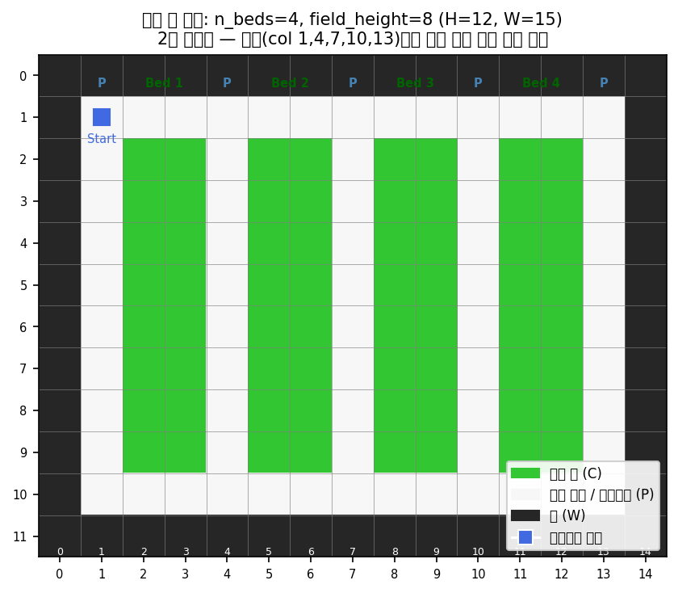

# 정밀농업 자율 로봇을 위한 커스텀 강화학습 환경 설계 및 적용

**학과**: AI로봇학과 | **제출일**: 2026-06-15 | **사용 언어**: Python 3.10

---

## 1. Introduction

### 1.1 연구 배경

스마트팜 관련 연구를 하다 보면 실제로 가장 귀찮은 게 작물 상태 확인이다. 드론이나 카메라로 전체를 찍는 방법도 있지만, 해충은 가까이서 봐야 알 수 있고 수확 적기도 직접 확인해야 정확하다. 자율 이동 로봇이 직접 돌아다니면서 필드를 순찰하고 조치까지 취하는 시스템을 강화학습으로 구현해보기로 했다.

### 1.2 강화학습 적용 근거

본 문제는 다음 세 가지 이유로 강화학습이 적합하다.

**순차적 의사결정**: 현재의 이동 선택이 이후 도달 가능한 영역과 잔여 작업량을 바꾼다. 매 스텝의 행동이 미래 보상에 영향을 주므로 단순 분류·회귀가 아닌 누적 보상 최대화 문제다.

**부분 관측(POMDP)**: 로봇은 예찰(Scout) 행동을 하기 전에는 작물의 실제 상태를 알 수 없다. "정보를 얻는 행동(예찰)"과 "정보를 활용하는 행동(조치)"이 분리되어 있어, 에이전트(또는 계층적 구조에서는 상위 정책)가 탐색과 활용의 순서를 스스로 결정해야 한다.

**경로 최적화의 조합론적 복잡성**: 5개 레인 방문 순서만 해도 최소 120가지(5!) 이상이며, 매 에피소드마다 작물 상태가 랜덤하게 바뀌므로 고정 규칙으로는 최적 대응이 불가능하다. 개별 작업은 규칙화할 수 있어도 이동 경로는 보상 신호로 학습하는 것이 적합하다.

### 1.3 연구 질문 및 검증 설계

본 연구는 위 세 특성을 만족하는 커스텀 환경을 구현하고, 다음 네 가지 연구 질문에 단계적으로 답한다.

| 단계 | 연구 질문 | 검증 대상 |
|------|----------|----------|
| Step 1 | 이산 격자 위에서 단일 정책(Flat RL)으로 본 문제를 학습할 수 있는가? | MaskablePPO + Action Masking |
| Step 2 | "전역 계획"과 "국소 실행"을 계층 구조로 분리하면 효율이 향상되는가? | Hierarchical PPO |
| Step 3 | 상위 정책의 관측에 거리 정보를 추가하면 최적 정책(Greedy)을 자동으로 발견하는가? | DQN + 거리 인식 obs |
| Step 4 | 연속 공간·연속 제어로 확장 가능한가? 어떤 알고리즘이 적합한가? | SAC vs TD3 vs TQC |

각 Step의 결과와 비교 분석은 §3 Results, §4 Discussion에서 다룬다.

### 1.4 ROS2 기반 시스템 아키텍처

시뮬레이션에서는 Gymnasium 환경이 5개 ROS2 노드를 통합 구현한다. 실제 로봇 배포 시 각 노드는 독립 프로세스로 분리될 수 있다.

```
[SceneObserverNode] → [RLAgentNode] → [ActionExecutorNode]
[EpisodeManagerNode] ← [RewardCalculatorNode] ←──────────┘
```

---

## 2. Materials and Methods

본 절은 §1.3의 네 연구 질문을 검증하기 위해 설계한 환경과 알고리즘을 기술한다. 결과·해석은 다루지 않는다.

### 2.1 공통 환경 설계

#### 2.1.1 농경지 구조: 2열 재배단

현실 온실의 수직재배 구조를 모델링한 **2열 재배단(two-column bed)** 격자 맵(Fig. 1)을 사용한다. 토마토·파프리카와 같은 작물은 줄기 양쪽으로 열매가 분포하므로, 로봇이 한쪽 레인에서 접근하면 안쪽 열만 스캔 가능하고 바깥쪽 열은 반대편 레인에서만 작업 가능하다. 이 **양면 접근(double-sided access) 제약**을 격자 상에서 표현하기 위해 단일 작물 줄을 안쪽·바깥쪽 두 열로 추상화하였다.



```
n_beds=4, field_height=8 → H=12, W=15

r0:  W W W W W W W W W W W W W W W
r1:  W P P P P P P P P P P P P P W   ← 상단 헤드랜드
r2:  W P C C P C C P C C P C C P W   ← 필드 행 (r2~r9)
r10: W P P P P P P P P P P P P P W   ← 하단 헤드랜드
r11: W W W W W W W W W W W W W W W

P=주행 레인, C=작물 셀, W=벽 / 레인 col: 1,4,7,10,13 (5개)
```

상단·하단 헤드랜드는 레인 간 이동을 매개하는 유일한 통로다. 레인 전환에는 실질적 이동 비용이 발생한다.

| 항목 | 값 |
|------|-----|
| 맵 크기 | 12 × 15 |
| 작물 셀 수 | 64개 |
| 주행 레인 수 | 5개 |
| 에이전트 시작 | (1, 1) — 상단 헤드랜드 |

#### 2.1.2 작물 상태 동역학 (POMDP)

각 작물은 에피소드 시작 시 아래 분포에 따라 무작위로 초기화되며, 실제 상태는 에이전트에게 **은닉**된다. 환경은 내부적으로 `_true_states`(은닉)와 `crop_states`(공개)를 분리해 관리한다. 예찰(Scout) 액션을 수행한 작물만 `crop_states`에 실제 상태가 공개되며, 이로 인해 환경은 POMDP 성격을 띤다.

| 초기 상태 | 확률 | 종결 조건 |
|----------|------|----------|
| 정상 (1) | 60% | 예찰만으로 확인 완료 |
| 수확 필요 (2) | 25% | 수확 액션으로 수확 완료(4) |
| 방제 필요 (3) | 15% | 방제 액션으로 방제 완료(5) |

모든 작물이 종결 상태 {1, 4, 5} 중 하나에 도달하면 에피소드가 성공 종료된다.

#### 2.1.3 보상 함수 (이산 환경 기본)

| 이벤트 | 보상 |
|--------|------|
| 매 스텝 | −0.1 |
| 충돌 시도 | −2.0 |
| 신규 셀 예찰 | +1.0 |
| 정상 확인 | +0.5 |
| 수확 성공 | +10.0 |
| 방제 성공 | +8.0 |
| 전체 완료 | +20.0 |

각 Step에서 변경된 보상 항목은 해당 절에서 별도 기술한다.

### 2.2 Step 1 — 이산 Flat RL

#### 목적
이산 격자에서 단일 정책으로 §1.3의 문제를 학습 가능한지 검증한다.

#### 환경 — FarmEnv

**관측**: `Box(0, 1, shape=(720,))` — 4채널 × 12 × 15

| 채널 | 내용 | 정규화 |
|------|------|--------|
| ch0 | 맵 구조 (0=통로, 1=작물, 2=벽) | ÷2 |
| ch1 | 에이전트 위치 one-hot | 0/1 |
| ch2 | 예찰 완료 마스크 | 0/1 |
| ch3 | 예찰 결과 (0=미지~5=방제완료) | ÷5 |

ch3는 §2.1.2의 POMDP 특성을 관측 벡터에 직접 반영한다. 예찰 전 작물은 0(미지)으로만 표현되므로 탐색 유인이 관측 구조에서 발생한다.

**행동**: `Discrete(7)` + Action Masking

| 인덱스 | 액션 | 마스킹 조건 |
|--------|------|------------|
| 0~3 | 이동 (상/하/좌/우) | 목적지가 작물/벽 |
| 4 | 예찰 (Scout) | 인접 미예찰 셀 없음 |
| 5 | 수확 | 인접 수확대기 셀 없음 |
| 6 | 방제 | 인접 방제대기 셀 없음 |

Action Masking은 무효 액션의 로짓을 −∞로 치환해 softmax 후 선택 확률을 0으로 만든다.

**종료**: 전체 작물 처리 완료 OR max_steps = 540

#### 알고리즘 — MaskablePPO

이산 행동 공간 + 동적 Action Masking을 동시에 지원하는 sb3-contrib 구현.

| 하이퍼파라미터 | 값 |
|--|--|
| n_envs (DummyVecEnv) | 16 |
| total_timesteps | 1,500,000 |
| learning_rate | 3×10⁻⁴ |
| n_steps | 512 |
| batch_size | 256 |

### 2.3 Step 2/3 — 이산 계층형 RL

#### 목적
- Step 2: 전역 계획(레인 선택)과 국소 실행(레인 처리)을 계층 분리하여 효율이 향상되는지 검증.
- Step 3: 상위 정책 관측에 거리 정보 추가가 최적 정책 발견을 유도하는지 검증.

#### 환경 — LaneExecutorEnv + HighLevelFarmEnv

**Low-level (LaneExecutorEnv)**: FarmEnv를 확장. ch4(목표 레인 마스크) 채널 추가 → 5채널 × 900-dim. 상위 정책이 지정한 목표 레인이 모두 처리되면 에피소드 종료(max_steps = 180/레인). 레인 완료 시 추가 보상 +10.0 (`REWARD_LANE_COMPLETE`).

**High-level (HighLevelFarmEnv)**: Low-level 정책을 호출하는 메타 환경. 한 step()마다 Low-level이 목표 레인 처리 종료까지 실행된다.

| 항목 | Step 2 (PPO HL) | Step 3 (DQN HL) |
|------|----------------|----------------|
| HL obs | 레인별 완료율(5) | 레인별 완료율(5) + **거리(5) = 10-dim** |
| HL action | Discrete 5 (레인 선택) | Discrete 5 |
| HL 알고리즘 | PPO | DQN |

Step 3의 거리 항목은 현재 에이전트 위치에서 각 레인 col까지의 정규화 거리. 이 정보가 Greedy nearest-lane 전략 발견에 기여하는지를 §3에서 검증한다.

#### 알고리즘

| | Low-level | High-level (Step 2) | High-level (Step 3) |
|--|--|--|--|
| 알고리즘 | MaskablePPO | PPO | DQN |
| total_timesteps | 700,000 | 50,000 | 30,000 |
| 비고 | Action Masking 유지 | On-policy | Off-policy, replay buffer |

### 2.4 Step 4 — 연속 환경 + 연속 제어

#### 목적
이산 격자 단순화를 넘어 연속 2D 좌표·연속 속도 제어로 정책이 확장 가능한지 검증한다. SAC·TD3·TQC 세 알고리즘의 적합성을 비교한다.

#### 환경 — ContinuousFarmEnv

| 항목 | 이산 환경 | 연속 환경 |
|------|----------|----------|
| 위치 | 격자 인덱스 | 실수 좌표 (x, y) |
| 이동 | 칸 단위 (4방향) | 속도 벡터 (vx, vy) |
| 예찰/조치 | 명시적 Scout/Harvest/Pest 액션 | 거리 임계값 이내 자동 |
| 충돌 | 목적지 셀 타입 | 기하학적 겹침 |

**관측**: `Box(-1, 1, shape=(28,))`

| 구성 | 차원 | 내용 |
|------|------|------|
| robot_pos + heading | 4 | 위치 (x, y) + 이동 방향 (cos, sin) |
| nav_flags | 4 | 4방향(N/S/E/W) 이동 가능 여부 |
| top-5 nearest crops | 20 | 가장 가까운 미처리 작물 5개의 (dx, dy, revealed, state) |

nav_flags는 로봇이 어느 방향이 막혀 있는지를 명시적으로 알게 해 연속 환경 특유의 충돌 반복 문제를 해결한다.

**행동**: `Box(-1, 1, shape=(2,))` — 속도 벡터 (vx, vy)

**보상**: 이산 대비 스케일 조정 (`R_STEP=−0.05`, `R_COLLISION=−1.0`, `R_SCOUT_NEW=+1.5`) + Potential-based shaping:

$$F(s, s') = \gamma\,\phi(s') - \phi(s), \quad \phi(s) = -\,\text{min\_dist}(s) \times 0.3$$

Ng et al.(1999)의 잠재 함수 차분 방식은 최적 정책 불변성을 보장하면서 희박 보상 환경의 학습 신호를 조밀하게 만들어 준다.

**종료**: 전체 작물 처리 완료 OR max_steps = 1200

**커리큘럼**:
- Level 0: 작물 바로 옆 스폰 (이동·예찰만 학습)
- Level 2: 헤드랜드 정상 스폰 (전체 에피소드)

#### 알고리즘 — SAC / TD3 / TQC 비교

세 알고리즘은 동일 환경·하이퍼파라미터(가능한 범위 내)에서 비교한다.

| | SAC | TD3 | TQC |
|--|--|--|--|
| 정책 형태 | Stochastic, 최대 엔트로피 | Deterministic + exploration noise | Stochastic, distributional Q |
| total_timesteps | 3,000,000 | 1,500,000 | 1,500,000 |
| batch_size | 4,096 | 4,096 | 4,096 |
| train_freq | 16 | 16 | 16 |

### 2.5 학습·평가 환경

| 항목 | 값 |
|------|-----|
| GPU | NVIDIA RTX 3080 (CUDA 12.4) |
| PyTorch | 2.5.1+cu124 |
| Python | 3.10 |
| 평가 에피소드 | 각 단계 ≥ 20 |

### 2.6 코드 구조 및 실행 방법

```
rlproject/
├── env/
│   ├── farm_env.py                       # Step 1 이산 환경
│   ├── map_generator.py                  # 2열 재배단 맵 생성
│   ├── continuous_farm_env.py            # Step 4 연속 환경
│   ├── continuous_farm_env_curriculum.py # 커리큘럼 + nav_flags
│   └── hierarchical/
│       ├── lane_executor_env.py          # Step 2/3 Low-level
│       └── high_level_env.py             # Step 2/3 High-level
├── train.py                              # Step 1
├── train_hierarchical.py                 # Step 2
├── train_step3.py                        # Step 3
├── train_sac_curriculum.py               # Step 4 SAC
└── evaluate*.py / record_gif*.py
```

```bash
pip install -r requirements.txt

python train.py                       # Step 1
python train_hierarchical.py          # Step 2
python train_step3.py                 # Step 3
python train_sac_curriculum.py        # Step 4

python evaluate_step3.py              # Step 1~3 비교
python record_gif_step3.py            # Step 3 데모
python record_gif_sac_curriculum.py   # Step 4 데모
```

---

## 3. Results

### 3.1 Step별 최종 성능 (20 에피소드 이상)

| 단계 | 알고리즘 | 성공률 | 커버리지 | 평균 스텝 |
|------|----------|--------|---------|---------|
| Step 1 | MaskablePPO (Flat) | 96% | 99.8% | 147~211 |
| Step 2 | Hierarchical PPO | 98% | 99.8% | 198 |
| **Step 3** | **DQN + 거리 인식 HL** | **100%** | **100%** | **141 ± 3** |
| Step 4 | SAC + Curriculum | 96.7% | 99.9% | 157 |

*(results_step3_comparison.png 참조)*

### 3.2 Step 3: RL이 Greedy 최적 정책을 자동 발견

| 방법 | 성공률 | 평균 스텝 | 레인 방문 |
|------|--------|---------|---------|
| Greedy nearest-lane (규칙 기반) | 100% | 141 ± 3 | 2.0 |
| **RL DQN + 거리 인식 obs** | **100%** | **141 ± 3** | **2.0** |

두 방법의 결과가 완전히 동일.

*(results_greedy_vs_rl.png 참조)*

### 3.3 Step 4: 연속 환경 알고리즘 비교

| 알고리즘 | 성공률 | 커버리지 | 평균 스텝 |
|---------|--------|---------|---------|
| TD3 | 0% | 42.3% | 1200 (truncated) |
| TQC | 3.3% | 60.0% | 1164 |
| **SAC** | **96.7%** | **99.9%** | **157** |

*(results_algo_comparison.png 참조)*

### 3.4 보조 실험: Action Masking 없는 학습

| 알고리즘 | 환경 | 성공률 | 커버리지 |
|---------|------|--------|---------|
| RecurrentPPO (LSTM, Masking 미지원) | 이산 | 0% | 0.9% |
| MaskablePPO | 이산 | 96% | 99.8% |

---

## 4. Discussion

### 4.1 §1.3 연구 질문에 대한 답

**Q1 (Step 1): 이산 격자에서 Flat RL로 학습 가능한가?**  
가능하다. 96% 성공·99.8% 커버리지 달성. 추가로 명시적 경로 알고리즘 없이 보상 설계만으로 Boustrophedon(지그재그) 패턴을 자발적으로 학습했다.

**Q2 (Step 2): 계층 분리로 효율이 향상되는가?**  
부분적으로 그렇다. 성공률 96%→98%, 그러나 평균 스텝은 큰 개선 없음. 단순 계층 분리만으로는 효율 향상이 제한적이었다.

**Q3 (Step 3): 거리 정보가 최적 정책 발견을 유도하는가?**  
그렇다. 100% 성공·100% 커버리지·141 스텝 달성. §3.2의 비교에서 RL DQN과 Greedy 규칙의 결과가 완전히 동일 — **올바른 관측을 주면 RL이 최적 휴리스틱을 자동으로 발견**한다는 것이 직접 확인되었다.

**Q4 (Step 4): 연속 환경 확장 가능한가? 어떤 알고리즘이 적합한가?**  
SAC + 커리큘럼으로 96.7% 달성. §3.3 비교에서 TD3·TQC 대비 SAC가 압도적으로 우수 — **희박 보상 환경에서 SAC의 최대 엔트로피 프레임워크가 결정적**이었다.

### 4.2 핵심 발견: 보상보다 관측 설계가 결정적이다

본 연구의 가장 일관된 관찰은 **관측 공간 설계가 보상 함수 튜닝보다 훨씬 결정적**이라는 것이다.

| 변경 | 성공률 변화 |
|------|-----------|
| 스텝 패널티 −0.1 → −0.3 (보상 강화) | 96% → 80% (악화) |
| HL obs에 거리 정보 추가 (관측 보강) | 90% → 100% (향상) |
| 연속 환경에 nav_flags 추가 (관측 보강) | 6% → 56% (대폭 향상) |

에이전트에게 필요한 정보를 제대로 제공하는 것이 보상 스케일을 조정하는 것보다 훨씬 큰 영향을 미쳤다.

### 4.3 Action Masking 필수성

§3.4에서 마스킹 미지원 RecurrentPPO는 0.9%로 완전 실패했다. 이산 행동 공간에서 무효 액션이 다수 존재하는 환경에서는 마스킹이 사실상 필수다.

### 4.4 한계 및 향후 연구

- **연속 계층형 RL**: SAC/PPO/A2C LL + DQN HL 조합은 1M 스텝으로 수렴 부족. goal-conditioned 태스크는 3M+ 스텝 또는 별도 커리큘럼이 필요하다.
- **다중 로봇 협력(MARL)**: MAPPO 기반 분할 예찰
- **실제 ROS2 배포**: `cmd_vel` 토픽으로 직접 연결
- **동적 환경**: 작물 성장 주기, 이동 장애물 추가

---

## 5. R&D 시행착오

§2~§4와 별도로, 최종 결과에 이르기까지의 실패·개선 과정을 기록한다.

### 5.1 환경 설계 변경

초기 1열 재배단(24셀) → 2열 재배단(64셀)으로 변경. 현실 농경지의 양면 접근 제약을 반영했다.

### 5.2 보상 스케일링 실험 (실패)

Low-level 스텝 패널티 −0.1→−0.3 강화 시 성공률 96%→80% 급락. "보상 강화가 항상 학습을 빠르게 만든다"는 직관이 깨지는 사례. §4.2의 결론으로 이어졌다.

### 5.3 SAC 연속 환경 반복 개선

| 시도 | 변경 | 커버리지 | 실패 원인 |
|------|------|---------|----------|
| v1 | 기본 SAC, obs=124-dim | 0% | 희박 보상 + 고차원 obs |
| v2 | Potential shaping | 6% | 정착 함정 |
| v3 | nav_flags 추가 | 56% | 방향 인식 부재 해결 |
| v4 | obs 단순화(28-dim) + 커리큘럼 | 96.7% | — |

### 5.4 연속 계층형 RL 실험 (실패)

이산 계층형 성공에 고무돼 연속 환경에도 시도했다.

| LL 알고리즘 | 커버리지 |
|------------|---------|
| SAC | 41.7% |
| PPO | 21.7% |
| A2C | 16.7% |

이산 LL과 달리 연속 LL은 "지정 레인으로 이동 후 그 레인만 처리"라는 **goal-conditioned 태스크**다. 1M 스텝으로는 수렴 부족. 부가적으로 VecNormalize 불일치 버그(HL이 raw obs 전달 → 분포 불일치)도 발견·수정했다.

### 5.5 코드 버그 발견 및 수정

| 버그 | 영향 | 수정 |
|------|------|------|
| `_goal_reached` 레인 전환 시 미리셋 | 2번째 이후 레인 goal bonus 누락 | 전환마다 False 리셋 |
| `_prev_potential` __init__ 미초기화 | reset() 전 step() 호출 시 crash | 0.0으로 초기화 |
| `_handle_move` bounds check 없음 | 맵 경계 외 접근 가능 | 경계 검사 추가 |

---

## 영상 클립

| 파일 | 내용 |
|------|------|
| `agent_demo.gif` | Step 1 MaskablePPO |
| `agent_demo_step3.gif` | Step 3 Goal+DQN (100%) |
| `agent_demo_greedy.gif` | 비교: Greedy nearest-lane |
| `agent_demo_sac_curriculum.gif` | Step 4 SAC Curriculum |
| `agent_demo_td3.gif` | 비교: TD3 |
| `agent_demo_tqc.gif` | 비교: TQC |

---

## 참고 문헌

- Stable-Baselines3: Raffin et al. (2021)
- SAC: Haarnoja et al. (2018) ICML
- TD3: Fujimoto et al. (2018) ICML
- TQC: Kuznetsov et al. (2020) ICML
- Potential-based Shaping: Ng, Russell & Bartlett (1999) ICML
- Hierarchical RL: Nachum et al. (2018) NeurIPS
- Boustrophedon Coverage: Choset (2001)
